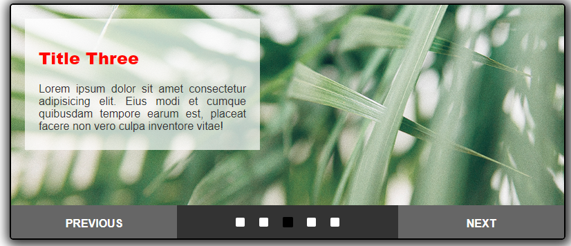

# Animation with Vannila JS

## Table of contents


  - [The challenge](#the-challenge)
  - [Screenshot](#screenshot)
  - [Links](#links)
  - [Built with](#built-with)
  - [What I learned](#what-i-learned)
  - [Author](#author)

## The challenge

Users should be able to:

- See pictures moving automatically to the left while the title appears coming down from top to bottom.

- To change pictures by using the previous, next and squares buttons.

- To stop the animation while the mouse cursor is over the buttons or the pictures.

- To spect animation runs again automatically after interacting with the page.

### Screenshots

</br>
<p align="center">
    
</p>
</br>

### Links

- Live Site URL: [thiagoando.github](https://thiagoando.github.io/news-homepage-main/)

## My process

### Built with

- Semantic HTML5 markup
- CSS custom properties
- Java Script

### What I learned

This challenge was a lot of fun. I loved it. By completing this carousel, I was able to sharpen my JS skills. The original version was built using [Jquery](<[https://reactjs.org/](https://jquery.com/)>) on the course [Animation with JavaScript and jQuery](https://www.coursera.org/learn/animation-javascript-jquery?specialization=javascript-beginner) on Coursera platform. However, I am more interested in sharpening my JS skills. Then I was confident that I could build it by coding in JS. Jquery is certain a great tool and easier than pure JS to build animation. But Jquery has been decaying in its use and has been replaced by other technologies like React library. That's why I decided to focus more on the fabulus Vannila JS.

You can check the code used to make it below:

```html
<!DOCTYPE html>
<html lang="en">
  <head>
    <meta charset="UTF-8" />
    <meta name="viewport" content="width=device-width, initial-scale=1.0" />
    <title>Slider</title>
    <link href="styles.css" rel="stylesheet" />
  </head>
  <body>
    <div id="slider-wrapper">
      <ul>
        <li>
          <div id="0">
            <h2>Title One</h2>
            <p>
              Lorem ipsum dolor sit amet consectetur adipisicing elit. Eius modi
              et cumque quibusdam tempore earum est, placeat facere non vero
              culpa inventore vitae!
            </p>
          </div>
        </li>
        <li>
          <div id="1">
            <h2>Title Two</h2>
            <p>
              Lorem ipsum dolor sit amet consectetur adipisicing elit. Eius modi
              et cumque quibusdam tempore earum est, placeat facere non vero
              culpa inventore vitae!
            </p>
          </div>
        </li>
        <li>
          <div id="2">
            <h2>Title Three</h2>
            <p>
              Lorem ipsum dolor sit amet consectetur adipisicing elit. Eius modi
              et cumque quibusdam tempore earum est, placeat facere non vero
              culpa inventore vitae!
            </p>
          </div>
        </li>
        <li>
          <div id="3">
            <h2>Title Four</h2>
            <p>
              Lorem ipsum dolor sit amet consectetur adipisicing elit. Eius modi
              et cumque quibusdam tempore earum est, placeat facere non vero
              culpa inventore vitae!
            </p>
          </div>
        </li>
        <li>
          <div id="4">
            <h2>Title Five</h2>
            <p>
              Lorem ipsum dolor sit amet consectetur adipisicing elit. Eius modi
              et cumque quibusdam tempore earum est, placeat facere non vero
              culpa inventore vitae!
            </p>
          </div>
        </li>
      </ul>
      <div id="slider-controls">
        <a href="#" id="prev">Previous</a>
        <div id="picsCheck">
          <span class="checked" id="pic1" value="0"></span>
          <span id="pic2" value="1"></span>
          <span id="pic3" value="2"></span>
          <span id="pic4" value="3"></span>
          <span id="pic5" value="4"></span>
        </div>
        <a href="#" id="next">Next</a>
      </div>
    </div>
    <div id="OnlyMobile">
      <p>
        For a better experience, move your phone to the landscape position. 😉
      </p>
    </div>
  </body>
  <script src="script.js"></script>
</html>
```

```css
body {
  padding-top: 50px;
  font-family: Arial;
  color: #333;
  font-size: 16px;
}

#slider-wrapper {
  width: 800px;
  height: 338px;
  margin: auto;
  position: relative;
  overflow: hidden;
  border: black solid 2px;
  border-radius: 5px;
  box-shadow: #333 2px 2px 16px 6px;
}

ul,
li {
  list-style-type: none;
  margin: 0;
  padding: 0;
}

#slider-wrapper ul {
  overflow: hidden;
  position: absolute;
  top: 0;
  left: 0;
  transition: left 700ms cubic-bezier(0.165, 0.84, 0.44, 1);
}

#slider-wrapper ul li {
  background-size: cover;
  position: relative;
  width: 800px;
  height: 300px;
  float: left;
  cursor: pointer;
}

#slider-wrapper ul li:nth-child(1) {
  background-image: url(images/leaves01.jpg);
}
#slider-wrapper ul li:nth-child(2) {
  background-image: url(images/leaves02.jpg);
}
#slider-wrapper ul li:nth-child(3) {
  background-image: url(images/leaves03.jpg);
}
#slider-wrapper ul li:nth-child(4) {
  background-image: url(images/leaves04.jpg);
}
#slider-wrapper ul li:nth-child(5) {
  background-image: url(images/leaves05.jpg);
}

#slider-wrapper > ul > li > div {
  display: none;
}

#slider-wrapper > ul > li > .content {
  position: absolute;
  display: block;
  text-align: justify;
  height: 150px;
  top: 20px;
  left: 20px;
  width: 300px;
  padding: 20px;
  background-color: rgba(255, 255, 255, 0.7);
  animation-name: show;
  animation-timing-function: ease;
  animation-duration: 3.5s;
}

@keyframes show {
  from {
    top: -190px;
  }
  to {
    top: 20px;
  }
}

#slider-wrapper > ul > li > .content h2 {
  color: rgb(255, 8, 0);
  font-weight: 800;
}

#slider-controls {
  height: 48px;
  position: absolute;
  bottom: 0px;
  left: 0;
  width: 100%;
  display: flex;
  background-color: #333;
  justify-content: space-between;
}

#slider-controls a {
  display: block;
  padding: 20px;
  color: #fff;
  font-weight: bold;
  text-transform: uppercase;
  text-decoration: none;
  text-align: center;
  line-height: 13px;
  width: 200px;
  background-color: #666;
}
#picsCheck {
  width: 150px;
  display: flex;
  align-items: center;
  justify-content: space-between;
  cursor: pointer;
}

#picsCheck span {
  width: 13px;
  height: 13px;
  background-color: white;
  border-radius: 2px;
}

#picsCheck .checked {
  background-color: rgb(0, 0, 0);
  border: black solid 1px;
}

#OnlyMobile {
  display: none;
}

@media only screen and (max-width: 410px) {
  #slider-wrapper {
    width: 330px;
    margin: auto;
  }

  #slider-wrapper ul li {
    width: 330px;
  }

  #slider-wrapper > ul > li > .content {
    display: flex;
    flex-direction: column;
    justify-content: center;
    width: 100px;
    height: 140px;
    left: 7px;
  }
  #slider-wrapper > ul > li > .content > h2 {
    font-size: 1rem;
  }

  #slider-wrapper > ul > li > .content > p {
    font-size: 0.5rem;
  }

  #slider-controls a {
    width: 50px;
    font-size: 0.7rem;
    display: flex;
    justify-content: center;
    align-items: center;
  }

  #picsCheck span {
    width: 7px;
    height: 7px;
  }

  #picsCheck span:first-of-type {
    margin-left: 10px;
  }

  #picsCheck span:last-of-type {
    margin-right: 10px;
  }

  #slider-controls {
    height: 38px;
  }

  #OnlyMobile {
    display: block;
    top: 200px;
    width: 330px;
    height: 100px;
    text-align: center;
    margin: auto;
  }

  #OnlyMobile p {
    text-align: center;
    margin-top: 50px;
    font-weight: 800;
    font-size: 1rem;
  }
}

@media only screen and (min-width: 410px) and (max-width: 800px) {
  #slider-wrapper {
    width: 615px;
  }

  #slider-wrapper ul li {
    width: 615px;
  }

  #slider-wrapper > ul > li > .content {
    display: flex;
    flex-direction: column;
    justify-content: center;
    width: 150px;
    height: 180px;
    left: 7px;
  }

  #slider-wrapper > ul > li > .content > p {
    font-size: 0.9rem;
    margin-bottom: 30px;
  }

  #slider-controls a {
    width: 100px;
    font-size: 0.9rem;
    display: flex;
    justify-content: center;
    align-items: center;
  }

  #picsCheck span {
    width: 10px;
    height: 10px;
  }

  #slider-controls {
    height: 38px;
  }

  #OnlyMobile {
    display: none;
  }
}
```

```js
window.addEventListener("load", function () {
  let slideCount = document.querySelectorAll("#slider-wrapper ul li").length;

  //How wide is each slide?
  let slideWith = document.querySelector("#slider-wrapper").offsetWidth - 4; // I had to add (-4px) because a add border to the slider-wrapper container. Then the pictures got wrong position on the screen.
  //Total width of the slider
  let totalWidth = slideCount * slideWith + "px";
  //Slider DOM element
  let slider = document.querySelector("#slider-wrapper ul");
  //Next button
  let next = document.getElementById("next");
  //Previous button
  let previous = document.getElementById("prev");
  //Upper left corner of slider
  let leftPosition = 0;
  //To keep track of each slide
  let counter = 0;
  //Sets the width of the slidetr (which is also in the CSS)
  slider.style.width = totalWidth;
  //Control Buttons checked
  const checked = document.querySelectorAll("#picsCheck span");

  let doneResizing = undefined;
  //First call to auto skip:
  autoSkip();
  //First call to title moving down:
  tiltleMOvingDown(0);

  this.window.addEventListener("resize", function () {
    this.clearTimeout(doneResizing);
    doneResizing = this.setTimeout(function () {
      slideWith = document.querySelector("#slider-wrapper").offsetWidth - 4; // I had to add (-4px) because a add border to the slider-wrapper container. Then the pictures got wrong position on the screen.
      totalWidth = slideCount * slideWith + "px";
      slider = document.querySelector("#slider-wrapper ul");
      leftPosition = 0;
      counter = 0;
      slider.style.width = totalWidth;
    }, 001);
  });

  //Slide title animation Down
  function tiltleMOvingDown(titleNum) {
    let allTitles = document.querySelectorAll("#slider-wrapper ul li div");
    allTitles.forEach((title) => {
      title.removeAttribute("class");
    });

    let title = document.getElementById(titleNum);
    title.classList.add("content");
  }

  //Stop slide when mouse is over
  slider.addEventListener("mouseover", function () {
    clearInterval(timer);
  });

  //Start slide when mouse is out
  slider.addEventListener("mouseout", function () {
    autoSkip();
  });

  //Run the slide automaticly
  function autoSkip() {
    timer = setInterval(() => {
      changeSlide();
    }, 3500);
  }

  //Remove class checked from all spans
  function removeClass() {
    checked.forEach((box) => {
      box.removeAttribute("class");
    });
  }

  //This change the slides when callled by set interval and when called by the span buttons
  //that's why I had to split the function into two parts.
  function changeSlide(buttonNumber) {
    removeClass();
    if (buttonNumber != undefined) {
      //buttonNumber will get a value only when the check buttons that are responsible to change the pictures be clicked.
      tiltleMOvingDown(buttonNumber);
      counter = buttonNumber;
      buttonNumber = undefined;
      checked[counter].classList.add("checked");
      changeSlidePartTwo();
    } else {
      counter++;
      changeSlidePartTwo();
    }

    function changeSlidePartTwo() {
      if (counter == slideCount) {
        counter = 0;
        leftPosition = 0;
        slider.style.left = leftPosition;
        tiltleMOvingDown(counter);
        checked[counter].classList.add("checked");
      } else {
        leftPosition = `-${counter * slideWith}px`;
        tiltleMOvingDown(counter);
        slider.style.left = leftPosition;
        checked[counter].classList.add("checked");
      }
    }
  }

  //Next Slide Click Handler
  next.addEventListener("click", function (event) {
    event.preventDefault();
    counter++;
    removeClass();

    if (counter == slideCount) {
      counter = 0;
      leftPosition = 0;
      slider.style.left = leftPosition;
      tiltleMOvingDown(counter);
      checked[counter].classList.add("checked");
    } else {
      leftPosition = `-${counter * slideWith}px`;
      slider.style.left = leftPosition;
      tiltleMOvingDown(counter);
      checked[counter].classList.add("checked");
    }
  });

  //The next button will stop set interval from changing the slides manually.
  next.addEventListener("mouseover", function () {
    clearInterval(timer);
    this.style.color = "orange";
  });
  //The next button will call autoSkip when mouse is out.
  next.addEventListener("mouseout", function () {
    autoSkip();
    this.style.color = "white";
  });

  //Previous Slide Click Handler
  previous.addEventListener("click", function (event) {
    event.preventDefault();
    removeClass();
    counter--;
    if (counter < 0) {
      counter = slideCount - 1;
      slider.style.left = `-${counter * slideWith}px`;
      tiltleMOvingDown(counter);
      checked[counter].classList.add("checked");
    } else {
      leftPosition = `-${counter * slideWith}px`;
      slider.style.left = leftPosition;
      tiltleMOvingDown(counter);
      checked[counter].classList.add("checked");
    }
  });

  //The previous button will stop set interval from changing the slides manually
  previous.addEventListener("mouseover", function () {
    clearInterval(timer);
    this.style.color = "orange";
  });
  //The previous button will call autoSkip when mouse is out
  previous.addEventListener("mouseout", function () {
    autoSkip();
    this.style.color = "white";
  });

  function forEveryButton(position) {
    clearInterval(timer); //Stop changing the pictures automaticly.
    changeSlide(position); //send the number of the button clicked to position the right picture on the screem.
    autoSkip(); //Restart the pictures changing automaticly after 3 and 1/2 seconds.
  }

  checked.forEach((box) => {
    box.addEventListener("click", function () {
      switch (box.getAttribute("value")) {
        case "0":
          slider.style.left = 0;
          forEveryButton(0);
          break;
        case "1":
          forEveryButton(1);
          break;
        case "2":
          forEveryButton(2);
          break;
        case "3":
          forEveryButton(3);
          break;
        case "4":
          forEveryButton(4);
          break;

        default:
          alert("Something went wrong with this box");
      }
    });
  });
});
```

### Continued development

Completing this project made me realize I need to improve my JS skills. This language is versatile and indispensable for building a good and functional user-friendly website. The next step is to use react library on my projects.

## Author

- Website - [Thiago Ando de Freitas](https://thiagoando.github.io/Portfolio/)
